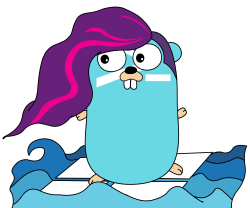

# gowindows
<!-- Badges -->
[![Build][build badge]][build page]
[![GoDoc][godoc badge]][godoc page]
[![GoReport][goreport badge]][goreport page]
[![Conventional Commits][convention badge]][convention page]



## Overview
**gowindows** is a Go library designed for remotely configuring and managing Windows-based systems.

Leveraging WinRM and SSH connections, gowindows provides a comprehensive set of functions to execute PowerShell commands, making it easy to automate tasks, manage users, groups, and more on remote Windows servers.

This library is especially useful when combined with tools like Terraform, enabling seamless integration into infrastructure as code workflows for Windows environments.

## Usage
### Single Client with a WinRM Connection
```go
package main

import (
	"context"
	"fmt"

	"github.com/d-strobel/gowindows/connection"
	"github.com/d-strobel/gowindows/parser"
	"github.com/d-strobel/gowindows/windows/local"
)

func main() {
	// WinRM configuration parameter
	winRMconfig := &connection.WinRMConfig{
		WinRMUsername: "vagrant",
		WinRMPassword: "vagrant",
		WinRMHost:     "winsrv",
		WinRMInsecure: true, // Ignore invalid certificates
	}

	// Connection configuration parameter
	conf := &connection.Config{
		WinRM: winRMconfig,
	}

	// New connection
	conn, err := connection.NewConnection(conf)
	if err != nil {
		panic(err)
	}

	// New parser
	parser := parser.NewParser()

	// Create client
	c := local.NewLocalClient(conn, parser)
	defer c.Connection.Close()

	// Create context
	ctx, cancel := context.WithCancel(context.Background())
	defer cancel()

	// Run the GroupRead function to retrieve a local Windows group
	group, err := c.GroupRead(ctx, local.GroupParams{Name: "Users"})
	if err != nil {
		panic(err)
	}

	// Print the user group
	fmt.Printf("User group: %+v", group)
}
```
### Multi Client with an SSH Connection
```go
package main

import (
	"context"
	"fmt"

	"github.com/d-strobel/gowindows"
	"github.com/d-strobel/gowindows/connection"
	"github.com/d-strobel/gowindows/windows/local"
)

func main() {
	// SSH configuration parameter
	sshConfig := &connection.SSHConfig{
		SSHHost:                  "winsrv",
		SSHPort:                  22,
		SSHUsername:              "vagrant",
		SSHPassword:              "vagrant",
		SSHInsecureIgnoreHostKey: true, // Ignore unknown or invalid host keys
	}

	// Connection configuration parameter
	conf := &connection.Config{
		SSH: sshConfig,
	}

	// Create client for the local package
	c, err := gowindows.NewClient(conf)
	if err != nil {
		panic(err)
	}
	defer c.Close()

	// Create context
	ctx, cancel := context.WithCancel(context.Background())
	defer cancel()

	// Run the GroupRead function to retrieve a local Windows group
	group, err := c.Local.GroupRead(ctx, local.GroupParams{Name: "Users"})
	if err != nil {
		panic(err)
	}

	// Print the user group
	fmt.Printf("User group: %+v", group)
}
```

## Development
### Conventional Commits
**gowindows** follows the conventional commit guidelines. For more information, see [conventionalcommits.org](https://www.conventionalcommits.org/).

### Testing
### Unit tests
Run unit tests:
```bash
make test
```

### Acceptance test
Prerequisites:
* [Hashicorp Vagrant](https://www.vagrantup.com/)
* [Oracle VirtualBox](https://www.virtualbox.org/)

Run acceptance tests:
```bash
make testacc
```

## Third-Party libraries
* For this project, I made a fork of [masterzen/winrm](https://github.com/masterzen/winrm).<br>
If the original library gets more maintenance, I will think about switching back.

## Inspirations
* [hashicorp - terraform-provider-ad](https://github.com/hashicorp/terraform-provider-ad):<br>
Hashicorp made a great start with the terraform-provider-ad. Currently, it seems that the provider is not actively maintained.<br>
Beyond that, my goal was to split that provider into a library and a provider and extend its functionality with non Active-Directory systems.

## License
This project is licensed under the [Mozilla Public License Version 2.0](LICENSE).

<!-- Badges -->
[godoc badge]: https://pkg.go.dev/badge/github.com/d-strobel/gowindows
[godoc page]: https://pkg.go.dev/github.com/d-strobel/gowindows

[goreport badge]: https://goreportcard.com/badge/github.com/d-strobel/gowindows
[goreport page]: https://goreportcard.com/report/github.com/d-strobel/gowindows

[build badge]: https://github.com/d-strobel/gowindows/actions/workflows/build.yml/badge.svg
[build page]: https://github.com/d-strobel/gowindows/actions/workflows/build.yml

[convention badge]: https://img.shields.io/badge/Conventional%20Commits-1.0.0-%23FE5196?logo=conventionalcommits&logoColor=white
[convention page]: https://conventionalcommits.org
